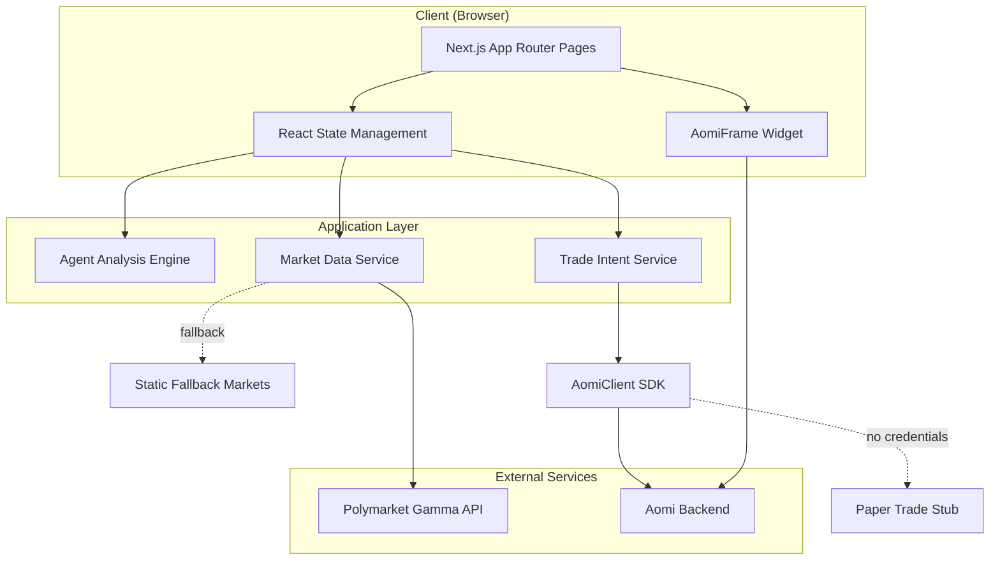

# Design Document: Polymarket Position Guard

## Overview

Polymarket Position Guard is a production-grade Next.js web application that provides automated position monitoring and trade execution guidance for Polymarket traders. The application integrates live market data from Polymarket's Gamma API, embeds aomi's AI agent widget for conversational assistance, and implements a rule-based analysis engine that evaluates positions against trader-defined take-profit and stop-loss thresholds.

### Core Value Proposition

Active Polymarket traders know what they want to do when market probabilities hit specific thresholds, but they cannot monitor positions 24/7. This application bridges that gap by:

1. **Continuous Market Monitoring**: Fetching live market data from Polymarket's public API
2. **Rule-Based Analysis**: Evaluating positions against trader-defined thresholds
3. **Actionable Guidance**: Generating specific trade recommendations with clear rationale
4. **Safe Execution Path**: Paper-trade mode by default, with clear upgrade path to live execution
5. **AI-Assisted Decision Making**: Embedded aomi agent for conversational trading guidance

### Design Principles

- **Production-First**: Built as a real product, not a demo or prototype
- **Safety by Default**: All execution is paper-trade safe until credentials are explicitly configured
- **Progressive Enhancement**: Works with fallback data when APIs are unavailable
- **Mobile-First Responsive**: Fully functional on screens 375px and above
- **Developer-Friendly**: Clear architecture, minimal setup time, easy to understand and extend

---

## Architecture

### High-Level System Architecture



### Technology Stack

**Frontend Framework**
- Next.js 14+ with App Router
- React 18+ with Server Components where appropriate
- TypeScript 5+ for type safety

**Styling**
- Tailwind CSS 3+ for utility-first styling
- Custom design tokens for dark web3 aesthetic
- CSS modules for component-specific overrides when needed

**State Management**
- React hooks (useState, useEffect, useCallback) for local component state
- URL query parameters for shareable state (market selection, thresholds)
- No global state library needed (app is single-page focused)

**External Integrations**
- `@aomi-labs/widget-lib`: AomiFrame component for embedded AI assistant
- `@aomi-labs/client`: AomiClient for natural-language trade intent submission
- Polymarket Gamma API: Live market data fetching

**Development & Deployment**
- Vercel for hosting and deployment
- ESLint + Prettier for code quality
- Environment variables for configuration

### Data Flow

1. **Market Discovery Flow**
   ```
   User loads app → MarketService fetches from Gamma API → Markets displayed in UI
   ↓ (on API failure)
   Fallback to static market data → Display with "Fallback" indicator
   ```

2. **Position Configuration Flow**
   ```
   User selects market → Pre-populate thresholds based on current probability
   ↓
   User adjusts position size, take-profit, stop-loss → Validate inputs
   ↓
   State synced to URL query params → Shareable link generated
   ```

3. **Agent Analysis Flow**
   ```
   User clicks "Run Agent" → AgentEngine evaluates current probability vs thresholds
   ↓
   Generate recommendation (HOLD/SELL/REDUCE) → Construct trade intent string
   ↓
   Send to AomiClient → Display backend response or paper-trade stub
   ↓
   Show AgentAnalysis with rationale, conditions, and execution payload
   ```

4. **AI Assistant Flow**
   ```
   User interacts with AomiFrame widget → Messages sent to Aomi backend
   ↓
   Backend processes conversational query → Response displayed in widget
   ```

---

## Components and Interfaces

### Component Hierarchy

```
app/
├── layout.tsx                    # Root layout with global styles
├── page.tsx                      # Main application page
└── components/
    ├── HeroSection.tsx           # Product name, value prop, CTA
    ├── MarketSelector.tsx        # Market list with search/filter
    ├── MarketDetails.tsx         # Selected market info display
    ├── PositionConfig.tsx        # Position size and threshold inputs
    ├── AgentControls.tsx         # "Run Agent" button and status
    ├── AgentResults.tsx          # Analysis output display
    ├── AomiWidget.tsx            # AomiFrame wrapper with error boundary
    ├── ExecutionBadge.tsx        # "Paper Trade" / "Live" indicator
    ├── StatusIndicator.tsx       # "Live" / "Fallback" data mode
    └── Footer.tsx                # Links and product description
```

### Key Component Specifications

#### 1. MarketSelector Component

**Purpose**: Display list of active Polymarket markets, allow selection

**Props**:
```typescript
interface MarketSelectorProps {
  markets: Market[];
  selectedMarketId: string | null;
  onSelectMarket: (marketId: string) => void;
  isLoading: boolean;
  isFallbackMode: boolean;
  onRefresh: () => void;
}
```

**State**:
- Search filter text
- Sort order (volume descending by default)

**Behavior**:
- Display up to 12 markets in a scrollable list
- Show market question, current YES probability, volume
- Highlight selected market
- Show loading skeleton during fetch
- Display "Fallback" badge when using static data
- Expose "Refresh Markets" button

#### 2. PositionConfig Component

**Purpose**: Input fields for position size and risk thresholds

**Props**:
```typescript
interface PositionConfigProps {
  positionSize: number;
  takeProfit: number;
  stopLoss: number;
  currentProbability: number;
  onPositionSizeChange: (size: number) => void;
  onTakeProfitChange: (threshold: number) => void;
  onStopLossChange: (threshold: number) => void;
}
```

**Validation**:
- Position size: minimum 1, integer only
- Take-profit: 1-99, integer only
- Stop-loss: 1-99, integer only
- Stop-loss must be < take-profit (show error if violated)

**Behavior**:
- Pre-populate take-profit at currentProbability + 10
- Pre-populate stop-loss at currentProbability - 10
- Clamp values to valid ranges
- Show validation errors inline
- Sync to URL query params on change

#### 3. AgentResults Component

**Purpose**: Display agent analysis output with clear visual hierarchy

**Props**:
```typescript
interface AgentResultsProps {
  analysis: AgentAnalysis | null;
  isLoading: boolean;
  error: string | null;
}

interface AgentAnalysis {
  headline: string;              // "Take Profit Triggered" | "Stop Loss Triggered" | "Hold Position"
  rationale: string;             // Plain-English explanation
  conditions: ConditionCheck[];  // List of evaluated conditions
  executionPayload: {
    action: 'HOLD' | 'SELL' | 'REDUCE';
    shareCount: number;
    referencePrice: number;
    mode: 'PAPER_TRADE' | 'LIVE';
  };
  tradeIntent: string;           // Natural-language string sent to aomi
  backendResponse: string;       // Response from AomiClient or stub
}

interface ConditionCheck {
  label: string;
  passed: boolean;
}
```

**Behavior**:
- Show loading spinner while agent runs
- Display headline prominently with color coding (green=profit, red=loss, blue=hold)
- Show rationale in readable paragraph
- Display conditions as checklist with icons
- Show execution payload in structured format
- Display trade intent and backend response
- Show execution mode badge

#### 4. AomiWidget Component

**Purpose**: Wrapper for AomiFrame with error boundary and fallback

**Props**:
```typescript
interface AomiWidgetProps {
  config: AomiFrameConfig;
}
```

**Behavior**:
- Render AomiFrame from `@aomi-labs/widget-lib`
- Catch rendering errors and display fallback UI
- Position widget to not obstruct main interface
- On mobile: collapsible or bottom-sheet style
- On desktop: fixed sidebar or floating panel

**Error Handling**:
- If widget fails to load, show placeholder with message
- Log error to console for debugging
- Ensure rest of app remains functional

### Service Layer Interfaces

#### MarketService

```typescript
interface MarketService {
  fetchActiveMarkets(): Promise<Market[]>;
  getMarketById(id: string): Market | null;
  refreshMarkets(): Promise<void>;
}

interface Market {
  id: string;
  question: string;
  currentProbability: number;  // 0-100
  volume: number;
  liquidity: number;
  endDate: string;
  active: boolean;
}
```

**Implementation Notes**:
- Fetch from `https://gamma-api.polymarket.com/markets?limit=25&active=true&closed=false`
- Parse response and map to internal Market interface
- On fetch failure, return fallback markets from static JSON
- Cache markets in memory for 60 seconds to reduce API calls

#### TradeIntentService

```typescript
interface TradeIntentService {
  sendTradeIntent(intent: string): Promise<TradeIntentResponse>;
  constructIntent(analysis: AgentAnalysis, market: Market): string;
}

interface TradeIntentResponse {
  success: boolean;
  message: string;
  mode: 'PAPER_TRADE' | 'LIVE';
}
```

**Implementation Notes**:
- Use AomiClient from `@aomi-labs/client` to send intents
- If credentials not configured, return paper-trade stub response
- Construct intent strings in format: "Sell [N] YES shares on [market question] at [price] cents"
- For HOLD actions: "Hold position on [market question] — no rule triggered"

#### AgentEngine

```typescript
interface AgentEngine {
  analyzePosition(
    market: Market,
    positionSize: number,
    takeProfit: number,
    stopLoss: number
  ): AgentAnalysis;
}
```

**Implementation Notes**:
- Pure function, no side effects
- Evaluate current probability against thresholds
- Generate recommendation based on rules:
  - If probability >= takeProfit: SELL 40% of position
  - If probability <= stopLoss: REDUCE 65% of position
  - Otherwise: HOLD
- Construct structured analysis object with all required fields

---

## Data Models

### Market Data Model

```typescript
interface Market {
  id: string;                    // Unique market identifier from Gamma API
  question: string;              // Market question text
  currentProbability: number;    // Current YES probability (0-100)
  volume: number;                // Total volume in USD
  liquidity: number;             // Available liquidity in USD
  endDate: string;               // ISO 8601 date string
  active: boolean;               // Whether market is currently active
  slug?: string;                 // URL-friendly slug (optional)
}
```

### Position Configuration Model

```typescript
interface PositionConfig {
  marketId: string;              // Selected market ID
  positionSize: number;          // Number of YES shares held (integer, min 1)
  takeProfit: number;            // Probability threshold for profit-taking (1-99)
  stopLoss: number;              // Probability threshold for loss-cutting (1-99)
}
```

**Validation Rules**:
- `positionSize >= 1`
- `1 <= takeProfit <= 99`
- `1 <= stopLoss <= 99`
- `stopLoss < takeProfit`

### Agent Analysis Model

```typescript
interface AgentAnalysis {
  headline: string;              // Summary headline
  rationale: string;             // Plain-English explanation
  conditions: ConditionCheck[];  // Evaluated conditions
  executionPayload: ExecutionPayload;
  tradeIntent: string;           // Natural-language intent string
  backendResponse: string;       // Response from aomi backend
  timestamp: string;             // ISO 8601 timestamp of analysis
}

interface ConditionCheck {
  label: string;                 // Condition description
  passed: boolean;               // Whether condition was met
}

interface ExecutionPayload {
  action: 'HOLD' | 'SELL' | 'REDUCE';
  shareCount: number;            // Number of shares to trade (0 for HOLD)
  referencePrice: number;        // Current market probability
  mode: 'PAPER_TRADE' | 'LIVE';  // Execution mode
}
```

### Fallback Market Data

```typescript
const FALLBACK_MARKETS: Market[] = [
  {
    id: 'fallback-1',
    question: 'Will Bitcoin reach $100,000 by end of 2024?',
    currentProbability: 68,
    volume: 1250000,
    liquidity: 85000,
    endDate: '2024-12-31T23:59:59Z',
    active: true
  },
  {
    id: 'fallback-2',
    question: 'Will the Fed cut rates in Q1 2024?',
    currentProbability: 42,
    volume: 890000,
    liquidity: 62000,
    endDate: '2024-03-31T23:59:59Z',
    active: true
  },
  // ... 10 more realistic markets
];
```

---

## Correctness Properties

*A property is a characteristic or behavior that should hold true across all valid executions of a system—essentially, a formal statement about what the system should do. Properties serve as the bridge between human-readable specifications and machine-verifiable correctness guarantees.*

### Property 1: Market Data Display Completeness

*For any* valid market returned by the Gamma API or fallback data, when displayed in the market list or details view, the rendered output SHALL contain the market question, current YES probability, volume, liquidity, and end date.

**Validates: Requirements 3.2, 3.3**

### Property 2: Default Threshold Calculation

*For any* market with a current probability P (where 1 ≤ P ≤ 99), when the market is selected, the pre-populated take-profit threshold SHALL be min(P + 10, 99) and the pre-populated stop-loss threshold SHALL be max(P - 10, 1).

**Validates: Requirements 4.4**

### Property 3: Threshold Validation

*For any* combination of take-profit threshold T and stop-loss threshold S, if S ≥ T, then the validation SHALL fail and display an error message preventing agent execution.

**Validates: Requirements 4.5**

### Property 4: URL State Persistence Round-Trip

*For any* valid position configuration (market ID, position size, take-profit, stop-loss), serializing the configuration to URL query parameters and then parsing it back SHALL produce an equivalent configuration with all values preserved.

**Validates: Requirements 4.6**

### Property 5: Agent Recommendation Logic

*For any* market with current probability P, position size N, take-profit threshold T, and stop-loss threshold S (where S < T):
- If P ≥ T, the agent SHALL recommend SELL action with approximately 40% of shares (0.4 × N)
- If P ≤ S, the agent SHALL recommend REDUCE action with approximately 65% of shares (0.65 × N)
- If S < P < T, the agent SHALL recommend HOLD action with 0 shares
- The AgentAnalysis output SHALL include headline, rationale, conditions list, and execution payload with action type, share count, reference price, and mode

**Validates: Requirements 5.1, 5.2, 5.3, 5.4, 5.5**

### Property 6: Trade Intent Construction

*For any* AgentAnalysis with action type A, share count N, market question Q, and reference price P:
- If A is SELL or REDUCE, the trade intent string SHALL match the format "Sell [N] YES shares on [Q] at [P] cents"
- If A is HOLD, the trade intent string SHALL match the format "Hold position on [Q] — no rule triggered"

**Validates: Requirements 6.2, 6.3**

---

## Error Handling

### Error Categories and Strategies

#### 1. External API Failures

**Gamma API Unavailable**
- **Detection**: Fetch request times out or returns non-200 status
- **Handling**: Immediately fall back to static fallback markets
- **User Feedback**: Display "Fallback" indicator badge
- **Recovery**: Expose "Refresh Markets" button to retry API call

**Gamma API Returns Invalid Data**
- **Detection**: Response parsing fails or required fields missing
- **Handling**: Log error to console, fall back to static markets
- **User Feedback**: Display "Fallback" indicator with error message
- **Recovery**: Same as above

#### 2. Aomi Integration Failures

**AomiFrame Widget Fails to Load**
- **Detection**: Error boundary catches rendering exception
- **Handling**: Render placeholder component with error message
- **User Feedback**: "AI Assistant temporarily unavailable"
- **Recovery**: Rest of app remains fully functional

**AomiClient Credentials Not Configured**
- **Detection**: Environment variables missing or invalid
- **Handling**: Use paper-trade stub response instead of real API call
- **User Feedback**: Display "Paper Trade" execution mode badge
- **Recovery**: Log warning, continue with simulated execution

**AomiClient API Call Fails**
- **Detection**: AomiClient throws error or returns error response
- **Handling**: Catch error, extract message
- **User Feedback**: Display error message in results panel
- **Recovery**: Allow user to retry or adjust configuration

#### 3. User Input Validation Errors

**Invalid Position Size**
- **Detection**: Value < 1 or non-integer
- **Handling**: Clamp to minimum 1, round to integer
- **User Feedback**: Inline validation message
- **Recovery**: Auto-correct on blur

**Invalid Thresholds**
- **Detection**: Values outside 1-99 range or stopLoss ≥ takeProfit
- **Handling**: Prevent agent execution, highlight invalid fields
- **User Feedback**: Inline error messages with specific guidance
- **Recovery**: User must correct values before proceeding

**No Market Selected**
- **Detection**: User clicks "Run Agent" without selecting market
- **Handling**: Prevent execution
- **User Feedback**: Display message "Please select a market first"
- **Recovery**: User selects market

#### 4. Runtime Errors

**Unexpected Exceptions**
- **Detection**: Error boundary at app root
- **Handling**: Catch error, log to console
- **User Feedback**: Display friendly error page with reload button
- **Recovery**: Page reload, report issue link

### Error Logging Strategy

**Development Mode**
- Log all errors to console with full stack traces
- Display detailed error messages in UI
- No error reporting service

**Production Mode**
- Log errors to console (visible in browser dev tools)
- Display user-friendly error messages in UI
- Consider adding error reporting service (e.g., Sentry) in future

### Graceful Degradation Hierarchy

1. **Full Functionality**: Live Gamma API + Aomi backend with credentials
2. **Degraded Mode 1**: Fallback markets + Aomi backend with credentials
3. **Degraded Mode 2**: Live Gamma API + Paper-trade mode (no credentials)
4. **Degraded Mode 3**: Fallback markets + Paper-trade mode (minimum viable)
5. **Degraded Mode 4**: Fallback markets + Paper-trade mode + No AI widget

At each level, the core agent analysis functionality remains operational.

---

## Testing Strategy

### Testing Approach

This application requires a dual testing strategy combining property-based tests for core business logic with example-based tests for UI components and integration points.

**Property-Based Testing**: Used for pure functions with universal properties (agent logic, data transformations, validation rules)

**Example-Based Testing**: Used for UI components, integration points, and specific scenarios

**Integration Testing**: Used for external service interactions and end-to-end workflows

**Manual Testing**: Used for visual design, responsive behavior, and user experience

### Property-Based Testing

**Library**: `fast-check` (JavaScript/TypeScript property-based testing library)

**Configuration**: Minimum 100 iterations per property test

**Test Organization**: Each property test references its design document property via comment tag

**Tag Format**: `// Feature: polymarket-position-guard, Property {number}: {property_text}`

#### Property Test Suite

**Property 1: Market Data Display Completeness**
```typescript
// Feature: polymarket-position-guard, Property 1: Market data display completeness
test('market display contains all required fields', () => {
  fc.assert(
    fc.property(
      arbitraryMarket(),
      (market) => {
        const rendered = renderMarketDisplay(market);
        expect(rendered).toContain(market.question);
        expect(rendered).toContain(market.currentProbability.toString());
        expect(rendered).toContain(market.volume.toString());
        expect(rendered).toContain(market.liquidity.toString());
        expect(rendered).toContain(market.endDate);
      }
    ),
    { numRuns: 100 }
  );
});
```

**Property 2: Default Threshold Calculation**
```typescript
// Feature: polymarket-position-guard, Property 2: Default threshold calculation
test('default thresholds are calculated correctly', () => {
  fc.assert(
    fc.property(
      fc.integer({ min: 1, max: 99 }),
      (probability) => {
        const defaults = calculateDefaultThresholds(probability);
        expect(defaults.takeProfit).toBe(Math.min(probability + 10, 99));
        expect(defaults.stopLoss).toBe(Math.max(probability - 10, 1));
      }
    ),
    { numRuns: 100 }
  );
});
```

**Property 3: Threshold Validation**
```typescript
// Feature: polymarket-position-guard, Property 3: Threshold validation
test('invalid threshold combinations are rejected', () => {
  fc.assert(
    fc.property(
      fc.integer({ min: 1, max: 99 }),
      fc.integer({ min: 1, max: 99 }),
      (stopLoss, takeProfit) => {
        fc.pre(stopLoss >= takeProfit); // Only test invalid cases
        const result = validateThresholds(stopLoss, takeProfit);
        expect(result.valid).toBe(false);
        expect(result.error).toBeTruthy();
      }
    ),
    { numRuns: 100 }
  );
});
```

**Property 4: URL State Persistence Round-Trip**
```typescript
// Feature: polymarket-position-guard, Property 4: URL state persistence round-trip
test('position config survives URL serialization round-trip', () => {
  fc.assert(
    fc.property(
      arbitraryPositionConfig(),
      (config) => {
        const queryString = serializeToURL(config);
        const parsed = parseFromURL(queryString);
        expect(parsed).toEqual(config);
      }
    ),
    { numRuns: 100 }
  );
});
```

**Property 5: Agent Recommendation Logic**
```typescript
// Feature: polymarket-position-guard, Property 5: Agent recommendation logic
test('agent produces correct recommendations for all probability ranges', () => {
  fc.assert(
    fc.property(
      fc.integer({ min: 1, max: 99 }), // probability
      fc.integer({ min: 1, max: 100 }), // position size
      fc.integer({ min: 1, max: 98 }), // stop loss
      fc.integer({ min: 2, max: 99 }), // take profit
      (probability, positionSize, stopLoss, takeProfit) => {
        fc.pre(stopLoss < takeProfit); // Valid configuration only
        
        const market = { ...mockMarket, currentProbability: probability };
        const analysis = analyzePosition(market, positionSize, takeProfit, stopLoss);
        
        // Verify structure
        expect(analysis).toHaveProperty('headline');
        expect(analysis).toHaveProperty('rationale');
        expect(analysis).toHaveProperty('conditions');
        expect(analysis).toHaveProperty('executionPayload');
        
        // Verify logic
        if (probability >= takeProfit) {
          expect(analysis.executionPayload.action).toBe('SELL');
          expect(analysis.executionPayload.shareCount).toBeCloseTo(positionSize * 0.4, 0);
        } else if (probability <= stopLoss) {
          expect(analysis.executionPayload.action).toBe('REDUCE');
          expect(analysis.executionPayload.shareCount).toBeCloseTo(positionSize * 0.65, 0);
        } else {
          expect(analysis.executionPayload.action).toBe('HOLD');
          expect(analysis.executionPayload.shareCount).toBe(0);
        }
      }
    ),
    { numRuns: 100 }
  );
});
```

**Property 6: Trade Intent Construction**
```typescript
// Feature: polymarket-position-guard, Property 6: Trade intent construction
test('trade intents are formatted correctly for all action types', () => {
  fc.assert(
    fc.property(
      arbitraryAgentAnalysis(),
      (analysis) => {
        const intent = constructTradeIntent(analysis);
        
        if (analysis.executionPayload.action === 'SELL' || 
            analysis.executionPayload.action === 'REDUCE') {
          expect(intent).toMatch(/^Sell \d+ YES shares on .+ at \d+ cents$/);
          expect(intent).toContain(analysis.executionPayload.shareCount.toString());
        } else {
          expect(intent).toMatch(/^Hold position on .+ — no rule triggered$/);
        }
      }
    ),
    { numRuns: 100 }
  );
});
```

### Example-Based Unit Tests

**UI Component Tests** (using React Testing Library):
- MarketSelector renders market list correctly
- PositionConfig validates input ranges
- AgentResults displays analysis output
- AomiWidget error boundary catches failures
- ExecutionBadge shows correct mode
- StatusIndicator shows correct data source

**Integration Tests**:
- MarketService fetches from Gamma API and falls back on error
- TradeIntentService sends to AomiClient or returns stub
- AgentEngine produces valid analysis for edge cases

**Specific Example Tests**:
- Empty market list triggers fallback
- Missing credentials trigger paper-trade mode
- Invalid thresholds prevent agent execution
- Refresh button re-fetches markets

### Test Coverage Goals

- **Core Business Logic**: 100% coverage with property-based tests
- **UI Components**: 80%+ coverage with example-based tests
- **Integration Points**: Key paths covered with mocked external services
- **Error Handling**: All error paths tested with example-based tests

### Testing Tools

- **Test Runner**: Vitest (fast, Vite-native)
- **Property Testing**: fast-check
- **React Testing**: @testing-library/react
- **Mocking**: Vitest mocks for external services
- **Coverage**: Vitest coverage reporter

---

