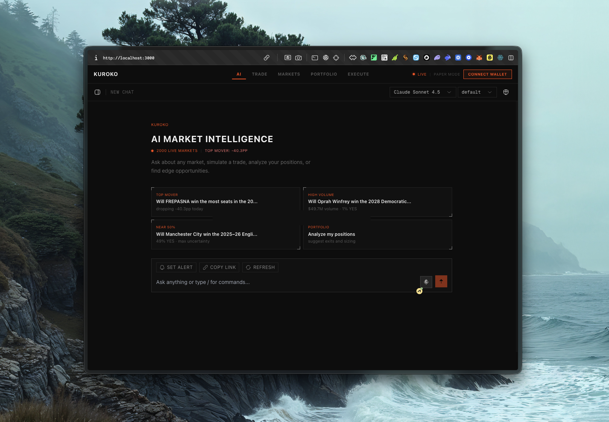

# Kuroko

> An AI trading companion for Polymarket — built on `@aomi-labs/client`, `@aomi-labs/widget-lib`, and Para SDK. The AI watches your positions while you sleep.

**Live demo:** [kuroko.vercel.app](https://kuroko.vercel.app) · **Started:** Monday, April 28 · **Submitted:** Friday, May 1 (Day 4)

---



---

## What This Is

Polymarket traders miss moves because they can't watch 1,000 markets simultaneously. Kuroko fixes that.

It's a full-stack AI-native trading terminal: live market data injected into every AI message, edge scoring across all active markets, and position guards that auto-execute stop-loss and take-profit rules through your wallet while you're offline.

The AI has live market data on every message — current probabilities, 24h/7d/30d price changes, volume, liquidity, and your open positions. It surfaces opportunities, explains the thesis, and routes a trade to your wallet without leaving the chat.

**The life-changing part:** position guards. Set a stop-loss once. The system polls every 60 seconds and executes the exit order through aomi → Para signing → Polymarket CLOB when your threshold hits. No manual monitoring. No missed exits.

> Paper trade mode works fully out of the box — no API keys, no wallet required. Markets load live from Polymarket's public API.

---

## Pages

| Route | Purpose |
|---|---|
| `/` | AI chat with live market context |
| `/trade` | Market dashboard + edge scoring + bet simulation |
| `/markets` | Full market browser with search, filters, and alerts |
| `/portfolio` | Positions, P&L, alerts, position guards, trade history |
| `/execute` | Direct order terminal with live order book and fill tracking |

---

## Setup

```bash
git clone https://github.com/0xgordian/kuroko
cd kuroko
npm install --legacy-peer-deps
cp .env.example .env.local
npm run dev
```

Open [http://localhost:3000](http://localhost:3000)

### Enable AI + Wallet

```env
# .env.local

# aomi backend — enables AI chat with live market context
NEXT_PUBLIC_AOMI_API_KEY=your_key_here

# Para SDK — enables wallet connect (Google, Twitter, Discord, email)
NEXT_PUBLIC_PARA_API_KEY=your_key_here
```

Get an aomi key at [aomi.dev](https://aomi.dev). The app works without it using the default aomi app.

---

## How aomi Powers This

Kuroko is built on three aomi primitives:

### `@aomi-labs/widget-lib` — `<AomiFrame />`

The entire AI chat interface. Drop-in React component with wallet awareness built in. Kuroko wraps it with a custom `Thread` component, custom markdown rendering, and a `trade_card` JSON → interactive UI bridge.

```tsx
// Zero-config embed
<AomiFrame backendUrl="/api/aomi" walletAddress={address} />
```

### `@aomi-labs/client` — `Session`

The TypeScript SDK for programmatic trade intent routing. When a user confirms a trade, `sendLiveOrder` builds an EIP-712 Polymarket order and routes it through an aomi `Session` to the connected wallet for signing.

```typescript
const session = new Session(
  { baseUrl: AOMI_BASE_URL, apiKey: AOMI_API_KEY },
  { app: AOMI_APP_ID, publicKey: walletAddress, userState: { chainId: 137 } }
);

// Handle on-chain transaction requests
session.on("wallet_tx_request", async (req) => {
  const txHash = await walletClient.sendTransaction(req.payload);
  await session.resolve(req.id, { txHash });
});

// Handle EIP-712 payloads (Polymarket CLOB orders)
session.on("wallet_eip712_request", async (req) => {
  const signature = await wallet.signTypedData(req.payload);
  await session.resolve(req.id, { signature });
});

const result = await session.send(fullMessage); // natural-language trade intent
```

### System Prompt Injection

Every chat message is enriched server-side with live Polymarket market data (top 10 by volume, 24h/7d/30d changes, biggest movers) and the user's open positions before hitting the AI. The agent reasons with real numbers, not stale context.

### Trade Card Flow

The AI returns structured JSON at the end of a trade recommendation:

```json
{
  "action": "trade_card",
  "market": "Will the Fed cut rates in June 2026?",
  "side": "YES",
  "shares": 50,
  "price": 44,
  "reasoning": "Fed futures pricing 68% cut probability vs 44% on Polymarket"
}
```

`parseTradeCard()` in `thread.tsx` detects this, renders a `TradeCard` component inline in the chat, and the user confirms — triggering `addTradeRecord` + `sendLiveOrder` (if wallet connected). The result is shared back to the thread via `shareToChat`.

### Para SDK

Social login (Google, Twitter, Discord, email) → non-custodial wallet on Polygon. No seed phrase. No private key management. Para handles all signing — Kuroko never touches a private key.

### Supported Chains

Kuroko runs on **Polygon (137)** for Polymarket. The aomi backend supports Ethereum (1), Arbitrum (42161), Base (8453), Optimism (10), and Polygon (137) — the same chain set is available for future integrations.

---

## Architecture

```
app/
  page.tsx                    # AI chat — AomiFrame + AutoSendBridge
  trade/page.tsx              # Markets dashboard + edge engine
  markets/page.tsx            # Full market browser
  portfolio/page.tsx          # Positions + P&L + alerts + guards
  execute/page.tsx            # Order terminal + fill tracking
  api/aomi/[...path]/         # aomi proxy — injects live market context
  api/markets/                # Gamma API cache (2min TTL) + CLOB enrichment
  api/clob/[...path]/         # CLOB proxy for order books
  api/positions/              # Positions proxy (CORS-safe)

components/
  assistant-ui/thread.tsx     # Custom aomi thread — dark terminal theme
  assistant-ui/trade-card.tsx # trade_card JSON → inline confirmation flow
  EdgeResults.tsx             # Scored opportunity cards with breakdown
  BetSimulation.tsx           # Trade modal — paper or live via sendLiveOrder
  PositionGuardPanel.tsx      # Stop-loss / take-profit rule manager
  TradeHistory.tsx            # Trade log with aggregate stats + CSV export
  AlertsPanel.tsx             # Price alerts + browser notifications
  CategoryFilter.tsx          # Elections/Crypto/Sports/Economics/Tech/World
  MobileBottomNav.tsx         # Mobile navigation (5 tabs)

lib/
  services/edgeEngine.ts           # Deterministic scoring (volume/liquidity/uncertainty/movement)
  services/signalEngine.ts         # Honest market signals from order book data
  services/tradeIntentService.ts   # aomi Session → EIP-712 → wallet signing
  services/orderFillService.ts     # CLOB fill polling (3s interval, 60s max)
  services/positionGuardService.ts # Stop-loss / take-profit automation
  services/tradeHistoryService.ts  # localStorage + outcome resolution
  services/alertService.ts         # Price alerts + browser notifications
  services/bankrollService.ts      # Bankroll tracking + sizing context
  stores/appStore.ts               # Zustand — shareToChat, dispatchTool, simulation state
```

---

## Key Features

### AI Chat (`/`)
- Natural language queries with live market data in every response
- AI knows current probabilities, 24h/7d/30d changes, your open positions
- `trade_card` JSON → interactive confirmation card inline in chat
- Paper trade or live execution without leaving the thread
- Thread persistence across navigation

### Trade Dashboard (`/trade`)
- 1000+ live markets refreshed every 15s (active) / 60s (idle)
- Edge engine scores markets 0–100 on volume, liquidity, uncertainty, 24h movement
- Category filters: Elections, Crypto, Sports, Economics, Tech, World
- Simulate Bet fetches real CLOB best-ask price before opening the modal
- AI widget embedded in the right column

### Markets (`/markets`)
- Full market browser with search, probability range, volume filter, 7 sort options
- Set price alerts on any market
- Category filter with counts

### Portfolio (`/portfolio`)
- Open positions from Polymarket Gamma API (wallet required)
- Price charts via lightweight-charts + CLOB history
- Trade history with resolved P&L, win rate, avg return, CSV export
- Price alerts with browser notifications (60s polling)
- Position guards: automated stop-loss and take-profit rules

### Execute (`/execute`)
- Live order book with depth visualization and spread in bps
- Market signals: TIGHT_SPREAD, HIGH_ACTIVITY, MOVING, LIQUID, NEAR_RESOLUTION, WIDE_SPREAD, LOW_VOLUME
- Slippage estimation from order book depth
- Bankroll sizing warnings
- Fill tracking: PENDING → OPEN → MATCHED → FILLED (3s polling)

---

## Security

- Rate limiting: 30/min (aomi proxy), 60/min (markets, CLOB, search, positions) — persistent via Upstash Redis when configured
- SSRF protection: UPSTREAM_BASE_URL validated against ALLOWED_HOSTS allowlist
- Wallet address validation: ETH_ADDRESS_RE regex prevents prompt injection via wallet param
- CSRF: referrer check on URL params for trade simulation
- Security headers: X-Frame-Options DENY, CSP, X-Content-Type-Options, Referrer-Policy
- Max request body: 20k chars on all proxies
- Trade limits: 10k shares / $10k per simulation
- No private keys stored — Para SDK handles all signing
- positionCache capped at 500 entries with LRU eviction
- Search query sanitized: strips `&=?#%` chars, capped at 200 chars

---

## Commands

```bash
npm run dev          # Development server
npm run dev:clean    # Clear .next cache then start (use after significant changes)
npm run build        # Production build
npm run lint         # TypeScript + ESLint
npm test             # Unit tests (Vitest) — 93 tests across 11 files
npm run test:coverage # Coverage report
```

---

## What's Next

These are the three verticals aomi is actively building toward. Kuroko is the proof-of-concept for the prediction market use case — here's how the same architecture extends to each.

### Prediction Markets — Autonomous Proposal Queue

The agent runs every 60s, scores all markets for correlated mispricings, and queues trade proposals with reasoning. You wake up to "3 proposals pending" — approve, dismiss, or set auto-execute rules. This is the bridge from AI-assisted to AI-native trading.

### Kalshi Integration

aomi has a native Kalshi plugin in its SDK. Same agent layer, cross-platform. When the same event is priced differently on Polymarket and Kalshi, surface the gap and route the arbitrage. The `Session` pattern is identical — swap the app ID, the execution layer handles the rest.

### Wallet AI Assistant

The demo that closes aomi's wallet client pipeline: a clean reference showing how a wallet (MetaMask, Rainbow, any Para-integrated wallet) embeds `<AomiFrame />` to give users an AI that explains transactions before signing. User types "what does this contract do?" — the agent simulates the transaction, shows exact token changes and gas costs, and lets the user sign or reject with full context. No more blind signing.

### GameFi

In-game asset trading, tournament prize pool distribution, NFT marketplace execution — all via natural language through `<AomiFrame />`. A GameFi studio drops the widget into their game client. Players type "sell my sword for the best price" — the agent routes through the right marketplace, simulates the transaction, and executes on confirmation. The aomi plugin architecture (12 reference apps: DeFi, Delta, Kalshi, Para, Polymarket, Social, and more) means each new marketplace is a plugin, not a rewrite.

### DeFi Momentum Bot

The `aomi-client-example` pattern — momentum rotation between risk and stable assets using moving-average signals — extended with Kuroko's edge scoring. Server-side scoring with CLOB depth, recent fill data, and whale activity signals feeding the allocation model. The bot runs locally, delegates execution to aomi, signs with viem. No custody, no API-key juggling.

---

## Distribution

X thread: [`docs/thread.md`](docs/thread.md)

---

## License

MIT

---

## Documentation

| File | Contents |
|---|---|
| [`docs/product-review.md`](docs/product-review.md) | Full A-Z product review — pages, services, PMF |
| [`docs/ui-ux-design-system.md`](docs/ui-ux-design-system.md) | Design system — colors, typography, layout rules |
| [`docs/fixes-summary.md`](docs/fixes-summary.md) | Complete log of all bugs fixed |
| [`TODO.md`](TODO.md) | Task tracker — completed and open items |
